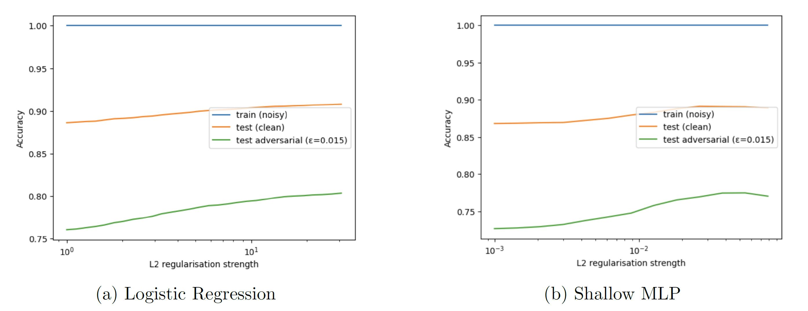
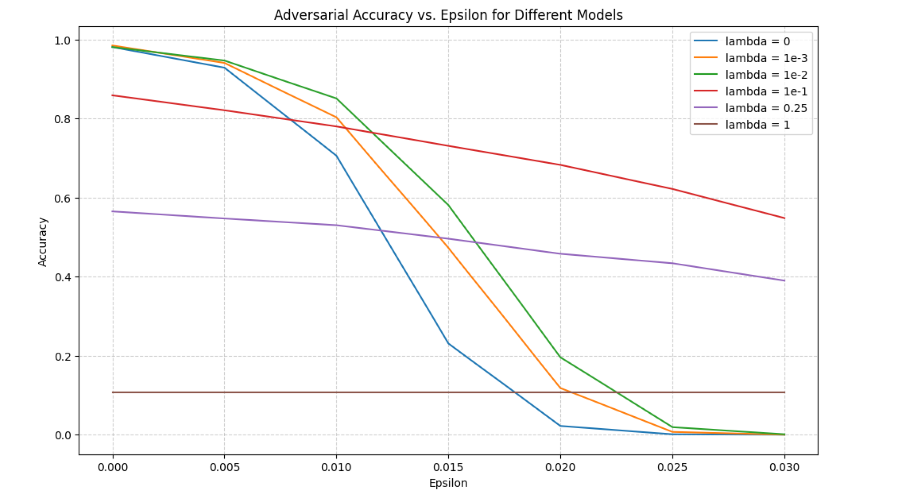

# Benign Overfitting and the Robustness Trade-Off

**Authors:** Kenneth Chow, Sreedeekshita Gorugantu Venkata, Artem Kiryukhin, Niket Patel, Warren Wu  
**Date:** June 2025  

This repository accompanies the paper:

> *Benign Overfitting and the Robustness Trade-Off*

---

## Overview

Modern machine learning models often exhibit **benign overfitting**: they interpolate noisy training data while still generalizing well to clean test data.  
At the same time, these models can be **highly vulnerable to adversarial perturbations**, where imperceptibly small input changes cause misclassification.

This project studies the statistical tension between these two phenomena and asks:

> **Can classical regularization (ℓ₁ / ℓ₂) improve adversarial robustness without destroying benign overfitting?**

We investigate this question through **controlled synthetic experiments** and **empirical validation on MNIST**, focusing on how regularization strength and input dimensionality affect standard and adversarial risk.

---

## Key Parameters

- **λ (lambda):** regularization strength  
- **ε (epsilon):** adversarial perturbation magnitude

Robust accuracy is evaluated under first-order adversarial attacks constrained by ε.

---

## Synthetic Experiments: Controlled Trade-Off Analysis

  

**Figure 1 (Synthetic data, page 4 of paper).**  
Adversarial accuracy as a function of ε for models trained with different regularization strengths λ.

**Observations:**
- Unregularized models fail rapidly as ε increases despite perfect training accuracy.
- Increasing λ significantly slows the degradation of adversarial accuracy.
- Excessive regularization eventually harms both clean and adversarial performance.

The synthetic setting isolates the **fundamental trade-off** between interpolation, robustness, and regularization strength.

---

## MNIST Experiments: Regularization Improves Robustness

  

**Figure 2 (MNIST, page 7 of paper).**  
Accuracy on noisy training data, clean test data, and adversarially perturbed test data (FGSM, ε = 0.015) as a function of regularization strength λ for logistic regression and a shallow multilayer perceptron.

**Observations:**
- All models achieve near-perfect training accuracy, indicating benign overfitting under label noise.
- Increasing λ slightly reduces clean test accuracy but **substantially improves adversarial accuracy**.
- Moderate regularization yields the strongest robustness–accuracy trade-off.

These results demonstrate that even in real, high-dimensional data such as MNIST, **classical regularization meaningfully mitigates adversarial vulnerability**.

---

## High-Dimensional Effects

Additional experiments increase input dimensionality while holding sample size fixed.  
We observe that:
- Training accuracy reaches 100%,
- Clean test accuracy deteriorates gradually,
- Adversarial accuracy degrades sharply,

even as parameter norms decrease.

This indicates that **norm control alone is insufficient** to guarantee robustness in high-dimensional regimes.

---

## Key Takeaways

- Benign overfitting and adversarial robustness are **not aligned objectives**.
- Regularization improves robustness but does not eliminate adversarial fragility.
- Moderate regularization provides the best empirical trade-off.
- Robustness depends critically on dimensionality and worst-case perturbations.

---

## Why This Matters

From a statistical perspective, this work highlights limitations of classical complexity control in modern, overparameterized models.  
It motivates further study of robustness beyond norm-based regularization alone.

---

## Code

The experiments were implemented in Python using standard numerical and deep learning libraries.

**Code and experiment scripts:**  
(See repository contents)

---

## References

Bartlett et al. (2020); Tsigler & Bartlett (2023); Hao & Zhang (2024);  
Goodfellow et al. (2017); LeCun & Cortes (2010)
